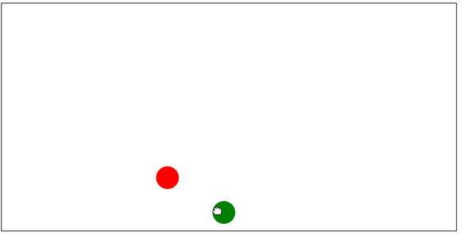

# Canvas multiplayer

## About

This is an try out of multi client communication over sockets

## Development

### Quick Start

```
npm start
```

Starts app in dev mode
start NodeJS server and watching files in client directory

### Prettier

```
npm run format
```

to format code

### Prettier

```
npm run eslint:fix
```

fix linting issues

## Production

[TODO]
currently there are no scripts for building for production.
It can be done manually when you know what you're doing

## Contribution

Feel free to contribute and extend the game.
You can create an issue with proposed functionality

## Extensions

- better collision detection
- implement different colors for different users
- implement points system


